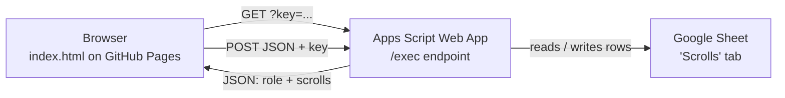
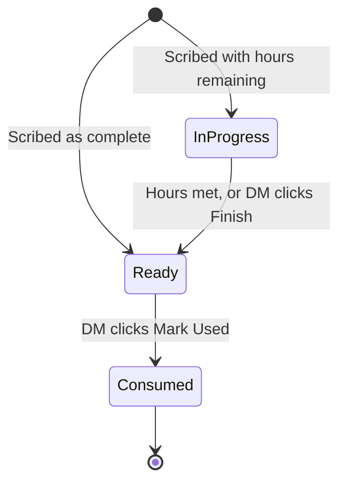

# Broken Realms — Arcane Scroll Ledger

A single-page web app for tracking spell scrolls in the **Broken Realms** D&D campaign.

Players can see which scrolls their character is holding, along with the save DC, attack bonus and
casting modifier for each one. The DM can scribe new scrolls, track downtime scribing progress by
the hour, and mark scrolls as used.

- **Live site:** https://midwaymonster.github.io/scroll-library/
- **Frontend:** one static `index.html` served by GitHub Pages
- **Backend / database:** a Google Sheet, exposed through a Google Apps Script web app

---

## How it works



There is no build step, no framework and no database server. `index.html` is plain HTML, CSS and
JavaScript; it fetches everything from the Apps Script endpoint at runtime.

### Roles

You unlock the app with a password ("access cipher"). The password determines your role:

| Role | Can do |
| --- | --- |
| **Player** | View active scrolls grouped by character, and optionally the spent-scroll history |
| **DM** | Everything a player can, plus scribe new scrolls, log downtime hours, finish scrolls, and mark scrolls as used |

Both passwords are stored in Apps Script **Script Properties**, never in this repository. The
backend validates the key on every request and rejects any write action that isn't from the DM key,
so DM powers are enforced on the server rather than by hiding buttons in the browser.

Your key is kept in `sessionStorage`, so a page refresh keeps you logged in but closing the tab
signs you out. There's also a 🔒 Lock button.

> **Note on security:** this is a shared-password scheme for a home game, not real authentication.
> Anyone who has the password has that role. Don't put anything sensitive in the sheet.

---

## The Google Sheet

The backend expects a tab named exactly **`Scrolls`**, with a header row and these columns **in this
order**:

| # | Column | Notes |
| --- | --- | --- |
| A | `ID` | Unique id, generated by the app from a timestamp |
| B | `Spell` | Spell name — scrolls are grouped by this |
| C | `SpellLevel` | Free text, e.g. `3rd` |
| D | `SaveDC` | e.g. `15` |
| E | `AttackBonus` | e.g. `+7` |
| F | `CastingModifier` | e.g. `Int +4` |
| G | `Holder` | Character the scroll belongs to |
| H | `Scribed by` | Who created it |
| I | `Status` | `Ready`, `In Progress`, or `Consumed` |
| J | `HoursCompleted` | Downtime hours logged so far |
| K | `TotalHoursRequired` | Downtime hours needed to finish |
| L | `CreatedDate` | Set automatically on creation |
| M | `ConsumedDate` | Set automatically when marked used |

### Scroll lifecycle



- **In Progress** scrolls appear only in the DM's Scribing Workbench.
- **Ready** scrolls appear in the party inventory.
- **Consumed** scrolls are hidden unless "Show Spent History" is ticked.

When logged hours reach or exceed `TotalHoursRequired`, the backend automatically flips the status
to `Ready` and clamps `HoursCompleted` to the total. Clicking **Finish** early does the same thing,
so a finished scroll never sits at something like `12 / 40`.

---

## Changing the passwords

The passwords live in the Apps Script project, so changing them takes about a minute and **does not
require touching this repo or re-deploying**.

1. Open the Google Sheet → **Extensions → Apps Script**.
2. In the left sidebar click the ⚙️ gear — **Project Settings**.
3. Scroll to the bottom, to **Script Properties**.
4. Click **Edit script properties**.
5. Change the value of `PLAYER_KEY` and/or `DM_KEY`.
6. Click **Save script properties**.

The change takes effect on the next login. Anyone already signed in keeps their session until they
close the tab or hit Lock.

| Property | Purpose |
| --- | --- |
| `PLAYER_KEY` | Read-only access |
| `DM_KEY` | Full access, including all writes |

### If the properties are missing

If neither property is set, the app shows *"Server keys not configured"*. Add them using the steps
above, or fill in the values in `setupKeys()` in [`example-code.gs`](example-code.gs), run that
function once from the editor, then blank the values out again before committing.

---

## Deploying a change

### Changing the web page

Edit `index.html`, commit, and push to `main`. GitHub Pages redeploys automatically.

GitHub caches the HTML for around 10 minutes, so hard-refresh if you don't see your change.

### Changing the backend

1. Paste the updated [`example-code.gs`](example-code.gs) into the Apps Script editor and save.
2. **Deploy → Manage deployments**
3. Click the **✏️ pencil** on the existing deployment.
4. Set **Version** to **New version**, then click **Deploy**.

> Saving in the editor is **not** enough — the `/exec` URL always serves the last *deployed version*.
> Forgetting step 4 is the most common cause of "it worked locally but not on the site".
>
> Use *Manage deployments*, not *New deployment*. "New deployment" mints a different `/exec` URL,
> which would then have to be pasted into `index.html`.

Deployment settings must be **Execute as: Me** and **Who has access: Anyone**. "Anyone with a Google
account" will cause the browser's cross-origin request to fail.

---

## Running locally

Open `index.html` directly, or serve it to get a proper `http://` origin:

```bash
python3 -m http.server 8765
# then open http://localhost:8765/index.html
```

Either way it talks to the **live** Apps Script endpoint and the real sheet, so any scroll you create
while testing is a real row.

### Checking the backend by hand

```bash
curl -sL "<YOUR_EXEC_URL>?key=probe"
```

| Response | Meaning |
| --- | --- |
| `{"error":"unauthorized"}` | Working correctly — bad key rejected |
| `{"error":"Server keys not configured..."}` | Deployed, but Script Properties aren't set |
| `[{"ID":...}]` | Old code still deployed — redeploy a new version |

---

## Files

| File | Purpose |
| --- | --- |
| `index.html` | The whole app — markup, styles and logic |
| `example-code.gs` | Copy of the Apps Script backend deployed against the sheet |
| `.nojekyll` | Tells GitHub Pages to serve files as-is and skip the Jekyll build |
| `README.md` | This file |

### Legacy files

`index2.html`, `index-broke-ui.html` and `index-prior-working.html` are older versions kept for
reference. They are broken against the current sheet layout and still contain the original
hard-coded passwords, so they should be deleted once they're no longer needed.
